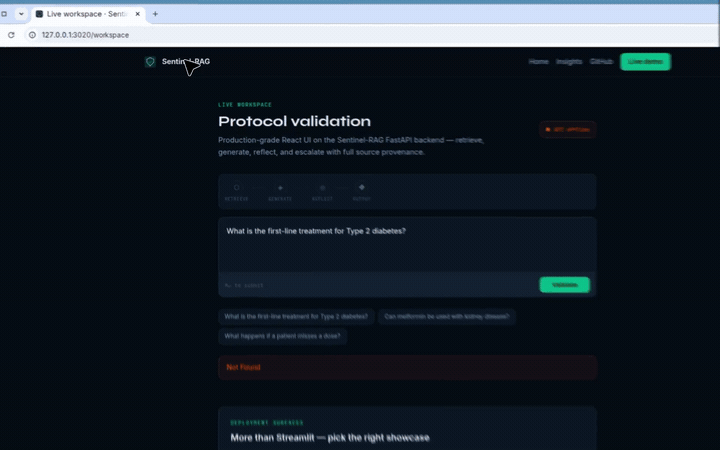

<div align="center">

# Sentinel-RAG

**Clinical Protocol Guardian**

This GitHub repository keeps the product in [`sentinel-rag/`](sentinel-rag/) so the Python package, landing app, and docs stay one tree.

[](sentinel-rag/README.md)
[](sentinel-rag/landing)
[](#watch-the-demo)

**Full product README → [sentinel-rag/README.md](sentinel-rag/README.md)**

</div>

---

## Watch the demo

This walkthrough **plays on this page** — it does not download a file.

<p align="center">
  
</p>

| Time in clip | What you are seeing | Why it matters |
| --- | --- | --- |
| Hero | “Clinical AI that knows when to say I don’t know” | The product is a safety layer, not a fluent chatbot |
| Features | Retrieve · Reflect · Escalate · Govern | Four promises GitHub visitors can check in code |
| Architecture | Five-node pipeline with a FLAG path | Uncertain answers are escalated, not hidden |
| Eval metrics | 50 questions, match / confidence / flag rate | Numbers come from `scripts/run_eval.py`, not marketing copy |
| Workspace | Protocol validation UI | The same pipeline, interactive |

This recording is the **portfolio + workspace chrome**. For live answers you also start the FastAPI agent (`GROQ_API_KEY` required). Details in the [product README](sentinel-rag/README.md).

---

## In plain English

Healthcare AI cannot afford a confident hallucination. Standard RAG returns the first fluent paragraph. Sentinel-RAG **scores grounding before you see the answer**:

```text
Question  →  Retrieve guideline chunks
          →  Generate a draft (context only)
          →  Reflect (deterministic confidence)
          →  high  →  show the answer
          →  medium →  retrieve more and retry
          →  low    →  FLAG for a clinician
```

The nested folder is intentional: clone this repo, then work inside `sentinel-rag/` as a normal Python + Next.js project.

---

## Repository map

```text
sentinal_rag/                         ← GitHub root
└── sentinel-rag/                     ← runnable product
    ├── src/                          agent, retrieval, reflection, FastAPI
    ├── landing/                      Next.js portfolio + /workspace
    ├── app.py                        Streamlit clinical workspace
    ├── tests/
    ├── docs/
    │   ├── demo.mp4                  this walkthrough
    │   ├── demo.gif
    │   └── PRD.md · TRD.md · ARCHITECTURE.md
    └── README.md                     full documentation
```

---

## Quick start

```bash
cd sentinel-rag
pip install -r requirements.txt
copy .env.example .env          # add GROQ_API_KEY
python -m src.ingest

# Terminal 1
uvicorn src.api.main:app --reload --port 8000

# Terminal 2
cd landing && npm install && npm run dev
```

| Surface | URL |
| --- | --- |
| Portfolio | http://localhost:3000 |
| Live workspace | http://localhost:3000/workspace |
| API docs | http://localhost:8000/docs |

---

<p align="center"><sub>Sentinel-RAG · grounded, self-auditing, willing to escalate</sub></p>
