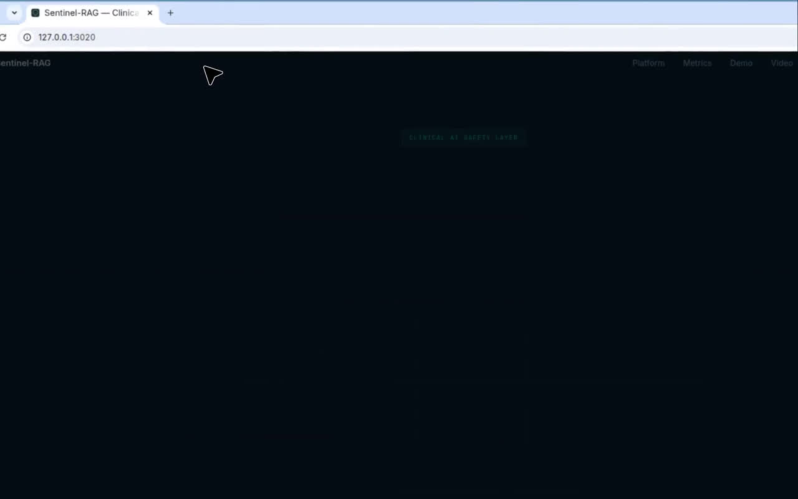

# Sentinel-RAG

This GitHub repository keeps the product in `sentinel-rag/` so the layout matches the Python package, landing app, and docs.

**Start here:** [sentinel-rag/README.md](sentinel-rag/README.md)

## Demo

[](sentinel-rag/docs/demo.mp4)

<video src="sentinel-rag/docs/demo.mp4" controls width="100%"></video>

If the player does not render on GitHub, download **[sentinel-rag/docs/demo.mp4](sentinel-rag/docs/demo.mp4)**.

The walkthrough opens the Next.js portfolio, scrolls architecture and eval metrics, then enters the live `/workspace`.

## Repository structure

```text
sentinal_rag/
└── sentinel-rag/          # runnable product (this is the working tree)
    ├── src/               # agent, retrieval, reflection, FastAPI
    ├── landing/           # Next.js portfolio + /workspace
    ├── app.py             # Streamlit clinical workspace
    ├── tests/
    ├── docs/              # PRD, TRD, safety, demo video
    └── README.md
```

## Quick start

```bash
cd sentinel-rag
pip install -r requirements.txt
uvicorn src.api.main:app --reload --port 8000
cd landing && npm install && npm run dev
```

- Portfolio: http://localhost:3000
- Live workspace: http://localhost:3000/workspace
- API docs: http://localhost:8000/docs
