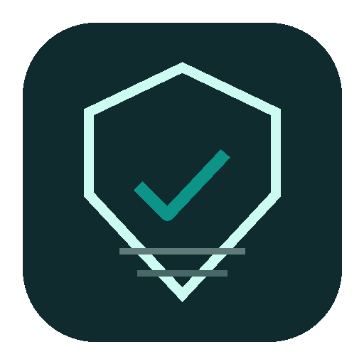
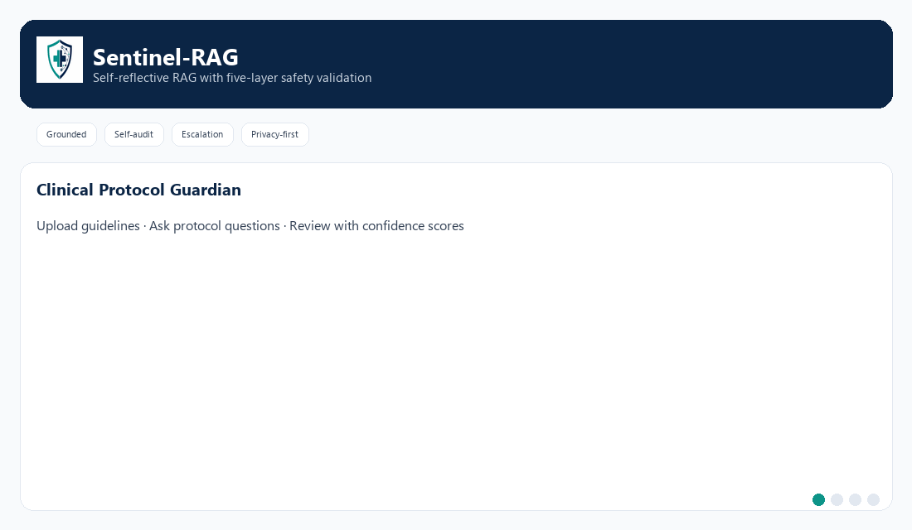

<div align="center">



# Sentinel-RAG

### Clinical Protocol Guardian

**Enterprise-grade self-reflective RAG for guideline-grounded clinical protocol validation**

[](https://github.com/devasai/sentinel-rag/actions/workflows/ci.yml)


</div>

---

**Sentinel-RAG answers clinical protocol questions strictly from your own guideline documents — and refuses to be confidently wrong.**

Its core innovation is a *five-layer safety pipeline*: retrieve → generate → **deterministic self-reflection** → independent cross-validation → human escalation when grounding is insufficient.

| Pillar | What it means |
| ------ | ------------- |
| **Grounded answers** | Strict context-only generation with source citations |
| **Self-audit loop** | Deterministic confidence scoring before every response |
| **Human escalation** | Low-confidence outputs flagged for clinical review |
| **Privacy-first** | Local vector store · on-prem-capable · auditable scoring |

📚 **[Full documentation →](docs/README.md)** · [PRD](docs/PRD.md) · [TRD](docs/TRD.md) · [App Flow](docs/APP_FLOW.md) · [Architecture](docs/ARCHITECTURE.md) · [Clinical Safety](docs/CLINICAL_SAFETY.md)

---



**Video walkthrough** (~12s auto-generated demo): [`docs/demo.mp4`](docs/demo.mp4) · regenerate with `python scripts/generate_demo_video.py`

*Sentinel-RAG validating clinical protocols with confidence scoring, self-correction, and human escalation*

---

## 🌐 Landing page & demo

| Surface | Best for | Command | URL |
| ------- | -------- | ------- | --- |
| **Portfolio site** | GitHub README, recruiters | `cd landing && npm run dev` | [http://localhost:3000](http://localhost:3000) |
| **Live workspace (Next.js)** | **Public demo — recommended** | API + `npm run dev` (see below) | [http://localhost:3000/workspace](http://localhost:3000/workspace) |
| **REST API (FastAPI)** | Integrators, Swagger, batch jobs | `uvicorn src.api.main:app --reload --port 8000` | [http://localhost:8000/docs](http://localhost:8000/docs) |
| **Clinical workspace (Streamlit)** | Internal prototyping, admin flows | `streamlit run app.py` | [http://localhost:8501](http://localhost:8501) |
| **Full stack (Docker)** | One-command local stack | `docker compose up --build` | UI `:8501` · API `:8000` |

**Recommended GitHub showcase** (professional, not Streamlit-only):

```bash
uvicorn src.api.main:app --reload --port 8000
cd landing && npm install && npm run dev
# Live demo → http://localhost:3000/workspace
```

Deploy the `landing/` app to Vercel; set `SENTINEL_API_URL` to your hosted FastAPI. See `landing/.env.example`.

**Video walkthrough:** Record a 3-minute demo with the word-for-word script in [docs/VIDEO_WALKTHROUGH.md](docs/VIDEO_WALKTHROUGH.md), then embed on the homepage via `NEXT_PUBLIC_LOOM_EMBED_URL`.

End-to-end platform guide: [docs/END_TO_END.md](docs/END_TO_END.md)

Brand assets live in `docs/brand/` (`logo.png`, `favicon.ico`, `apple-touch-icon.png`). Regenerate with `python scripts/generate_brand_assets.py`.

---

## 🩺 The Problem

- **Healthcare AI cannot afford a confident hallucination.** A fluent but ungrounded answer about a dose, contraindication, or protocol step isn't a bad UX — it's a patient-safety event.
- **Standard RAG fails silently.** Conventional retrieve-then-answer pipelines return whatever the model produces on the *first* pass, with no check that the answer is actually supported by the retrieved guidelines. The model's confidence is unrelated to whether it's right.
- **Sentinel-RAG is different: it self-audits.** Every answer is scored for grounding before it's shown. The system can still be unsure — but when it is, it *says so and escalates*, instead of presenting an unverified answer as authoritative.

---

## 🧠 Architecture

```
                            ┌──────────────────────────────────────────────┐
                            │      medium confidence (retries remaining)    │
                            ▼                                                │
  ┌──────────┐     ┌───────────────┐     ┌───────────────┐     ┌────────────┴────────┐
  │  User    │     │   RETRIEVE    │     │   GENERATE    │     │       REFLECT        │
  │  Query   │ ──► │ ChromaDB      │ ──► │ Groq          │ ──► │ deterministic        │
  │          │     │ top-k chunks  │     │ Llama 3.1 8B  │     │ confidence scoring   │
  └──────────┘     └───────────────┘     └───────────────┘     └──────────┬───────────┘
                            ▲  (expanded top-k on retry)                   │
                            │                                              │ route decision
                            └──────────────────────────────────────────────┤
                                                                           │
            confidence ≥ 0.85 ─────────────────────────►┌──────────────────▼──────────────────┐
                                                         │                OUTPUT                │ ──► END
            confidence < 0.75  ─── FLAG ────────────────►│  answer + confidence % + retries +   │
            retries exhausted  ─── FLAG ────────────────►│  source citations  (⚠ review banner) │
                                                         └──────────────────────────────────────┘
```

---

## 📊 Key Results

> These metrics are produced by the reproducible evaluation harness
> (`scripts/run_eval.py`) over the 50-question dataset in `data/eval/` — **not**
> hand-picked or self-reported. The table is filled in from `eval_results.json`
> after you run the harness against an ingested knowledge base.

| Metric (from `scripts/run_eval.py`) | Value                                  |
| ----------------------------------- | -------------------------------------- |
| Questions evaluated                 | 50                                     |
| Keyword match rate                  | 54%                                |
| Average confidence                  | 64%                                |
| Flag rate                           | 60%                                |
| Average response time               | 41065ms                            |
| Two-model validation agreement      | 88%                                |
| Two-model validation                | Cross-checks every response            |

> **Interpreting these numbers:** The bundled corpus is a single fictional **diabetes**
> guideline. With only that ingested, most eval questions (harm reduction, hypertension,
> drug interactions) are correctly **flagged** — hence the high flag rate. That behavior
> is the safety feature, not a regression. Re-run after ingesting full guideline coverage
> to get representative cross-category metrics.

---

## 🧪 Evaluation

Sentinel-RAG ships with a reproducible, externally-runnable evaluation so its
claims can be checked rather than trusted.

- **Dataset:** `data/eval/eval_questions.json` — 50 questions across 5 categories
  (diabetes, harm reduction, hypertension, drug interactions, general protocols),
  each with expected-answer keywords, a source (ADA/CDC/FDA), and a difficulty.
- **Harness:** `scripts/run_eval.py` runs every question through the full agent
  and records confidence, flag status, the two-model validation verdict, keyword
  hits, and response time, then writes `data/eval/eval_results.json`.

```powershell
pip install -r requirements.txt
copy .env.example .env          # add GROQ_API_KEY
python -m src.ingest            # ingest guidelines covering the eval categories
python scripts/run_eval.py
```

```text
=== SENTINEL-RAG EVALUATION REPORT ===
Questions evaluated: 50
Keyword match rate: XX%
Average confidence: XX%
Flag rate: XX%
Avg response time: XXXms
Validation agreement: XX%
======================================
```

> The bundled corpus is a single **fictional diabetes** guideline, so out of the
> box only the diabetes questions will be well-grounded — the rest will correctly
> be flagged as unsupported. To get representative numbers across all categories,
> ingest real diabetes / harm-reduction / hypertension / interaction guidelines
> first. That "flag what you can't support" behavior is the safety feature, not a bug.

---

## 🧱 Tech Stack

| Technology                | Role                              | Why chosen (over alternatives)                                                                                          |
| ------------------------- | --------------------------------- | ---------------------------------------------------------------------------------------------------------------------- |
| **LangGraph**             | Agentic state machine             | Models the draft → reflect → retry **cycle** explicitly. A plain LangChain chain is linear and can't loop on itself.   |
| **Groq · Llama 3.1 8B**   | LLM generation                    | Open weights + self-hostable (path to air-gapped on-prem), HIPAA-friendlier, ~500 tok/s. GPT-4 is closed and slower.   |
| **ChromaDB** (local)      | Vector store                      | Runs on-prem — clinical data never leaves the machine, no third-party BAA. Pinecone ships every vector to a SaaS.      |
| **all-MiniLM-L6-v2**      | Embeddings                        | Small, fast, CPU-only — keeps the offline privacy posture intact (no embedding API calls leave the box).               |
| **LangChain**             | Prompt + chain orchestration      | Clean prompt templating and composition with first-class tracing hooks.                                                |
| **LangSmith**             | Observability / tracing           | Every generation (and its context) becomes inspectable — essential for auditing a clinical safety layer.               |
| **Streamlit**             | Clinician-facing UI               | Fastest path to a clean, healthcare-appropriate UI with file upload + dataframes.                                      |
| **pytest + pytest-mock**  | Testing                           | Mocks ChromaDB/Groq so the suite runs with **no API keys** and no network.                                             |
| **Docker / compose**      | Deployment                        | Reproducible, portable, one-command spin-up.                                                                           |

---

## ⚙️ How It Works (plain English)

1. **Retrieve** — Your clinical question is matched against the guideline documents you've loaded, pulling the most relevant passages from a local vector database.
2. **Generate** — A fast language model drafts an answer, under strict instructions to use *only* the retrieved guidelines and to state uncertainty openly.
3. **Reflect (the core idea)** — Before you ever see the answer, Sentinel-RAG grades how well it's actually supported by the source text. If it's confident, it returns the answer. If it's *borderline*, it automatically goes back and gathers more context, then tries again. If it's *unsure*, it stops and flags the answer for a human clinician to review.
4. **Output** — You get the answer plus a confidence score, how many times the agent re-checked itself, the source passages it relied on, and a clear warning banner if the answer needs review.

---

## 💬 Sample Output

Generated by `python scripts/generate_demo_data.py` against the bundled fictional
`sample_diabetes_guideline.txt`. The **confidence scores and routing decisions are real
output from the deterministic scoring engine** (`src/reflection.py`) — note how query 4
self-corrects with a re-query, and query 5 (not covered by the guidelines) is flagged
instead of answered.

```text
======================================================================
 SENTINEL-RAG — DEMO RUN
 Self-reflective clinical protocol agent
======================================================================

[1/5] Q: What is the first-line treatment for Type 2 diabetes?
----------------------------------------------------------------------
Confidence:   98%  |  Retries: 0  |  Status: RETURNED
----------------------------------------------------------------------
Metformin is the recommended first-line pharmacological therapy for adults with
type 2 diabetes mellitus unless contraindicated. It should be initiated at 500 mg
once daily with the evening meal and titrated gradually over 4 to 6 weeks, up to a
maximum of 2000 mg per day. (Protocol GLY-2024, Section 1)

[2/5] Q: What are metformin contraindications?
----------------------------------------------------------------------
Confidence:   86%  |  Retries: 0  |  Status: RETURNED
----------------------------------------------------------------------
Metformin is contraindicated in patients with an eGFR below 30 mL/min/1.73m2 due to
the risk of lactic acidosis. It should also be temporarily discontinued in patients
undergoing procedures requiring iodinated contrast media. (Protocol GLY-2024, Section 4)

[3/5] Q: What is the HbA1c target for elderly patients?
----------------------------------------------------------------------
Confidence:   96%  |  Retries: 0  |  Status: RETURNED
----------------------------------------------------------------------
For older adults with multiple comorbidities, limited life expectancy, or a history
of severe hypoglycemia, a more relaxed HbA1c target of less than 8.0 percent is
appropriate, compared with the general target of less than 7.0 percent for most
non-pregnant adults. (Protocol GLY-2024, Section 2.2)

[4/5] Q: Can metformin be used with kidney disease?
----------------------------------------------------------------------
Confidence:   88%  |  Retries: 1  |  Status: RETURNED (after 1 re-query)
----------------------------------------------------------------------
Metformin can be used in kidney disease only with careful attention to renal
function. It is contraindicated in patients with an eGFR below 30 mL/min/1.73m2 due
to the risk of lactic acidosis, and should be temporarily discontinued in patients
undergoing procedures requiring iodinated contrast media. (Protocol GLY-2024, Section 4)

[5/5] Q: What happens if a patient misses a dose?
----------------------------------------------------------------------
Confidence:   27%  |  Retries: 0  |  Status: FLAGGED FOR REVIEW
----------------------------------------------------------------------
⚠️ FLAGGED FOR CLINICAL REVIEW

The provided guidelines do not address what a patient should do after a missed dose.
This information is not mentioned in the available protocol, so I cannot determine the
correct action from the current guidelines.

======================================================================
 SUMMARY: 5 queries  |  1 self-corrected  |  1 flagged for review
======================================================================
```

> The wording of each answer comes from the LLM and will vary slightly between runs;
> the **confidence, retry, and flag behavior is driven by the deterministic reflection
> layer**. Re-run the script with your own `GROQ_API_KEY` to reproduce.

---

## 🚀 Quick Start (Windows / PowerShell)

```powershell
# Step 1 — Clone
git clone https://github.com/devasai/sentinel-rag.git
cd sentinel-rag

# Step 2 — Install dependencies
python -m venv .venv; .\.venv\Scripts\Activate.ps1
pip install -r requirements.txt

# Step 3 — Add your API keys
copy .env.example .env
#   then edit .env:  GROQ_API_KEY=...   LANGCHAIN_API_KEY=...  (LangSmith)

# Step 4 — Ingest the sample (or your own) guidelines into ChromaDB
python -m src.ingest

# Step 5 — Launch the app
streamlit run app.py
```

Then open <http://localhost:8501>.
*(Run ingestion as a module — `python -m src.ingest` — so package imports resolve correctly.)*

---

## 📁 Project Structure

```
sentinel-rag/
├── src/
│   ├── agent.py          # LangGraph state machine — the self-reflection loop
│   ├── retriever.py      # All ChromaDB ops: parent/child collections, retrieval
│   ├── chains.py         # Groq LLM + the strict clinical RAG prompt
│   ├── reflection.py     # Deterministic confidence scoring (the core innovation)
│   ├── validator.py      # Second-model cross-validation (fact-checker)
│   ├── recency_scorer.py # Temporal recency scoring — flags outdated sources
│   ├── feedback_logger.py # Interaction + human-rating log (reward-model dataset)
│   ├── ingest.py         # TXT/PDF loading, parent-child chunking pipeline
│   └── data_sources/
│       └── pubmed.py     # PubMed E-utilities fetcher with recency metadata
├── data/guidelines/      # Drop your clinical guideline .txt / .pdf files here
├── tests/                # Mocked unit + component tests — run with no API keys
├── scripts/
│   ├── generate_demo_data.py  # Runs 5 sample queries → the Sample Output above
│   ├── generate_demo_gif.py     # Builds docs/demo.gif for README / landing
│   ├── run_eval.py              # 50-question reproducible evaluation harness
│   └── sync_eval_metrics.py     # Push eval_results.json → README + landing
├── landing/                     # Next.js investor / portfolio site (npm run dev → :3000)
├── ui/
│   └── theme.py                 # Premium clinical UI theme and components
├── docs/                        # PRD, TRD, app flow, architecture, clinical safety
│   ├── README.md                # Documentation hub
│   └── brand/                   # logo.png, favicon.ico, apple-touch-icon.png
├── .streamlit/
│   └── config.toml              # Brand colors and Streamlit theme
├── app.py                # Streamlit UI (validate tab + query history tab)
├── requirements.txt      # Pinned dependencies
├── Dockerfile            # python:3.11-slim image, Streamlit entrypoint
├── docker-compose.yml    # Port mapping + chroma_db/.env volume mounts
├── .env.example          # Template for required environment variables
└── README.md             # You are here
```

---

## 🔬 The Self-Reflection Loop (technical)

```python
def reflect_node(state: AgentState) -> AgentState:
    """Score the draft's grounding and decide what to do next."""
    confidence = score_confidence(state["response"],
                                  state["retrieved_docs"],
                                  state["query"])
    retry_count = state["retry_count"]
    flagged = False

    if confidence >= HIGH_CONFIDENCE:            # 0.85 — well grounded
        route = "output"
    elif confidence >= MEDIUM_CONFIDENCE and retry_count < MAX_RETRIES:
        route = "retrieve"                       # borderline → widen + retry
        retry_count += 1
    else:                                        # low conf OR retries spent
        route = "flag"                           # escalate to human review
        flagged = True

    return {**state, "confidence": confidence, "flagged": flagged,
            "retry_count": retry_count, "route": route}
```

**In plain English:** after the model drafts an answer, `score_confidence` rates how grounded it is using four transparent factors — vocabulary overlap with the retrieved guidelines (0.40), absence of hedging language (0.30), specificity/length (0.20), and no contradiction of the source (0.10). A high score is returned immediately; a borderline score triggers a wider re-retrieval and a second attempt; a low score (or an exhausted retry budget) is flagged for a clinician.

**Why this matters for clinical safety:** the scorer is **deterministic and auditable — not a second LLM grading the first.** Using another model as the only safety check would just stack one hallucination risk on another and would be impossible to defend in a regulatory review. Here, every confidence score can be explained after the fact ("low because the answer shares almost no vocabulary with the source and contains 'I'm not sure'"). Crucially, surfacing uncertainty is treated as a *successful* outcome — "please review this" is safe; a silent, confident hallucination is not.

---

## 🔁 Continuous Learning (toward a learned reward model)

Sentinel-RAG continuously collects interaction data to train a learned reward model — moving beyond heuristic confidence scoring toward a data-driven approach.

Every run appends a feature row to `data/feedback/confidence_log.csv` (confidence, validation verdict, flag, retries, retrieved-doc count, latency, response preview). When a user rates a response with the 👍 / 👌 / 👎 controls, that 1–5 score is written back as the row's `human_rating`. Over time these `(features, human_rating)` pairs become a supervised dataset: the exact training signal a reward model learns from. The sidebar's **📊 Feedback Stats** panel surfaces the dataset as it grows (total interactions, average confidence, flag rate, average user rating, total rated). This is the systematic path from a transparent v1 heuristic to a v2 learned scorer.

## 🔭 Future Improvements

- **Fine-tuned reward model** — replace the heuristic scorer with a small classifier trained on clinician-labeled (grounded / hallucinated) answer pairs, while keeping the deterministic factors as an explainable fallback.
- **Async + parallel processing** — make retrieval and the reflection passes async so multiple queries (and the retry loop) run concurrently, driving median latency well below the current target.
- **Pinecone (or hybrid) for scale** — offer a managed vector backend behind a proper BAA for multi-institution, multi-region corpora, while keeping local ChromaDB as the privacy-first default.
- **FHIR integration** — ingest and reason over structured EHR data (FHIR resources) so the agent can validate protocols against an individual patient's context, not just static guidelines.
- **Multi-agent ensemble validation** — add independent verifier agents (e.g. a citation-checker and a contradiction-detector) and require consensus before an answer is returned, raising the bar for high-confidence output.

---

## 👤 Author

**Devasai Pranatheswar**
MS in Analytics, Northeastern University
🔗 [LinkedIn](https://www.linkedin.com/in/devasai-pranatheswar) · ✉️ devasai.pranatheswar@example.com

---

> ⚠️ **Disclaimer:** Sentinel-RAG is a research prototype for demonstration only. It is **not** a medical device and must **not** be used for actual clinical decision-making. The bundled sample guideline is entirely fictional test data.
