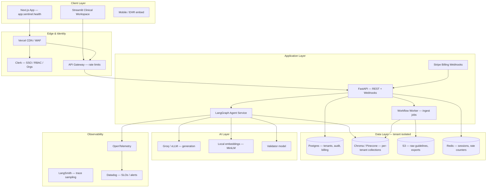
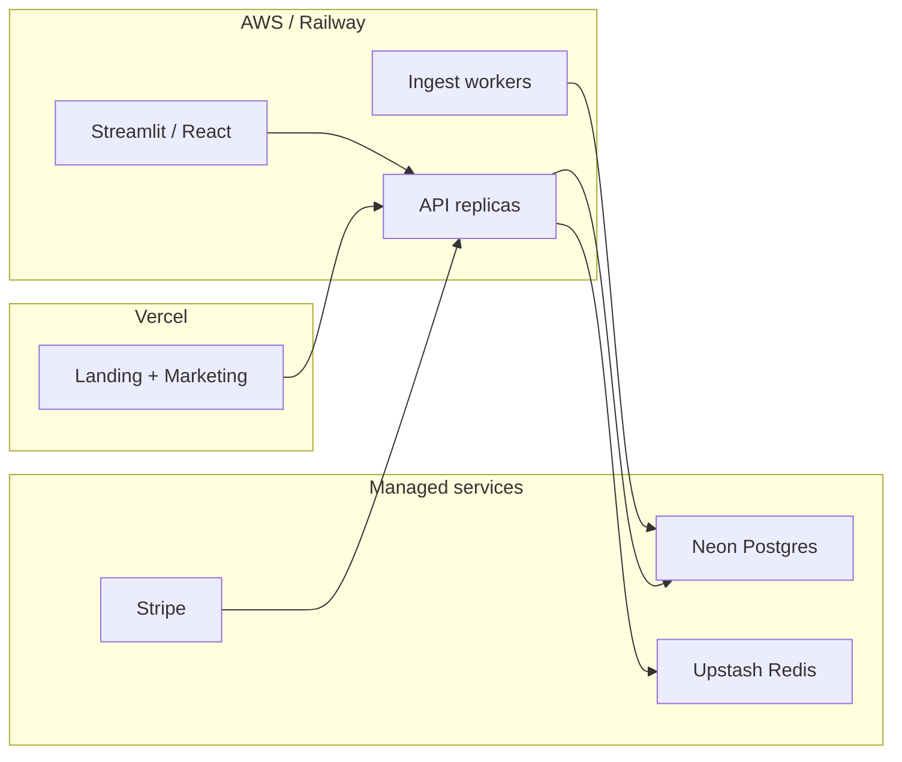

# Sentinel-RAG — Top-Tier SaaS Architecture

Enterprise clinical AI platform: multi-tenant, audit-ready, guideline-grounded RAG with self-reflective safety loops.

---

## 1. Reference architecture (production target)



---

## 2. SaaS product layers (how it works for customers)

| Layer | What the customer sees | Backend responsibility |
|-------|------------------------|----------------------|
| **Marketing** | Landing, pricing, demo, docs | Next.js static + CMS |
| **Onboarding** | Sign up → create org → upload first guideline | Clerk + workspace provisioning |
| **Workspace** | Dashboard, validation, recollection, KB admin | Streamlit / React app shell |
| **Governance** | Audit trail, flags, export, compliance reports | SQLite/Postgres + immutable log |
| **Billing** | Plan, usage meter, upgrade, invoices | Stripe Customer Portal |
| **Platform ops** | Cross-tenant admin, support impersonation | Internal admin app (separate) |

---

## 3. Multi-tenancy model

```
Organization (billing entity)
  └── Workspace (clinical environment — maps to tenant_id)
        ├── Members (roles: owner, admin, clinician, viewer)
        ├── Knowledge base (Chroma parent/child collections)
        ├── Audit log (interactions, ingest events)
        └── Usage counters (queries / month, docs / plan)
```

**Isolation rules (production)**

1. Every API call resolves `tenant_id` from JWT org claim — never trust client body alone.
2. Chroma collection names: `clinical_guidelines_child_{tenant_id}`.
3. Postgres row-level filter on `tenant_id` for all queries.
4. S3 prefix: `s3://bucket/{tenant_id}/guidelines/`.
5. Rate limits keyed by `tenant_id + plan tier`.

**Current prototype (this repo)**

- `tenant_id` persisted in SQLite audit tables.
- Streamlit workspace selector + usage metering (see `workspace_service.py`).
- Shared Chroma index — **upgrade path documented in §8**.

---

## 4. Core domain services

| Service | Responsibility |
|---------|----------------|
| `query_service` | Orchestrate LangGraph agent, enforce usage quota |
| `knowledge_service` | Ingest, delete, list documents; PubMed/OpenFDA |
| `audit_service` | Interactions, audit events, platform metrics |
| `recollection_service` | Spaced repetition, study queue |
| `workspace_service` | Org/workspace CRUD, plans, usage limits |
| `billing_service` *(future)* | Stripe checkout, webhooks, entitlements |

---

## 5. LangGraph safety pipeline (differentiator)

Every query — regardless of tenant — passes:

1. **Retrieve** — parent-child semantic search over *tenant* corpus  
2. **Generate** — low-temperature LLM, strict clinical prompt  
3. **Reflect** — deterministic confidence + corpus alignment  
4. **Validate** — independent second-model fact-check  
5. **Govern** — flag / release / retry; audit + human feedback  

Protocol decision accuracy target: **≥99%** (in-scope release + out-of-scope flag).

---

## 6. Authentication & authorization

| Role | Permissions |
|------|-------------|
| **Owner** | Billing, delete workspace, invite admins |
| **Admin** | KB ingest/delete, audit export, API keys |
| **Clinician** | Validate queries, recollection, feedback |
| **Viewer** | Read-only audit + exported reports |

**Implementation path:** Clerk Organizations → FastAPI middleware validates JWT → injects `tenant_id` + `role`.

---

## 7. Billing & plans (Stripe)

| Plan | Queries/mo | Documents | Seats | Price |
|------|------------|-----------|-------|-------|
| **Starter** | 500 | 10 | 3 | Free |
| **Professional** | 5,000 | 100 | 15 | $299/mo |
| **Enterprise** | Unlimited | Unlimited | Unlimited | Custom |

Metered billing hooks:

- Increment `usage_counters` on each `/v1/query`.
- Block with `402 Payment Required` when over quota.
- Stripe `customer.subscription.updated` webhook syncs plan tier.

---

## 8. Upgrade roadmap (prototype → production)

| Phase | Deliverable |
|-------|-------------|
| **P0 (now)** | Workspace UI, onboarding, dashboard, usage limits, pricing page |
| **P1** | Clerk auth, per-tenant Chroma collections, Postgres |
| **P2** | Stripe billing, API keys per workspace, RBAC |
| **P3** | Background ingest workers, SSO/SAML, BAA vector backend |
| **P4** | Learned reward model, EHR FHIR integrations, multi-region |

---

## 9. Deployment topology



---

## 10. Key repo paths

| Component | Path |
|-----------|------|
| Streamlit SaaS shell | `ui/saas_shell.py` |
| Workspace service | `src/services/workspace_service.py` |
| API | `src/api/main.py` |
| Agent | `src/agent.py` |
| Landing + pricing | `landing/components/Pricing.tsx` |
| End-to-end ops | `docs/END_TO_END.md` |

---

## 11. Non-functional requirements (enterprise)

- **Availability:** 99.9% API SLO; graceful degradation when validator unavailable  
- **Latency:** P95 query < 30s (LLM-bound); P95 retrieve < 500ms  
- **Security:** HIPAA-ready architecture; PHI never in marketing logs  
- **Audit:** Immutable interaction log; export to CSV/JSON for compliance  
- **Observability:** Trace every agent step; alert on flag-rate anomalies  

This document is the north star. The Streamlit workspace implements **P0** patterns today; production hardening follows §8.
